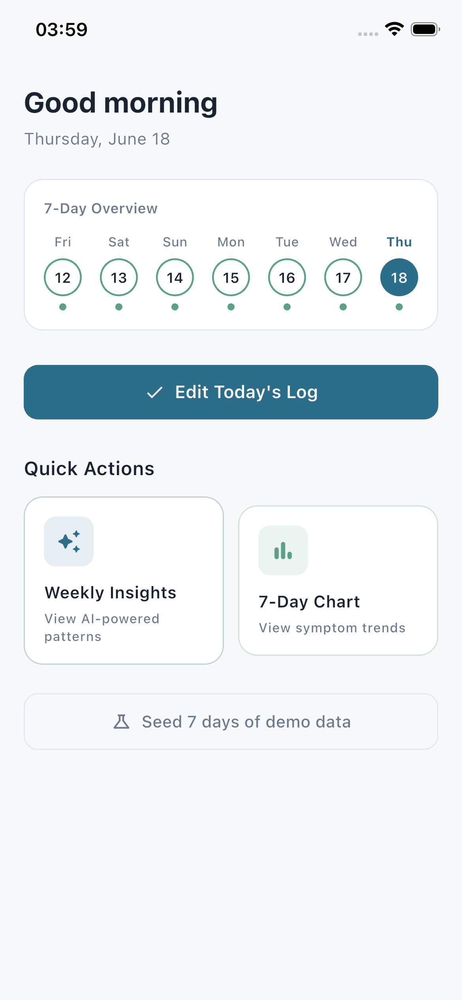
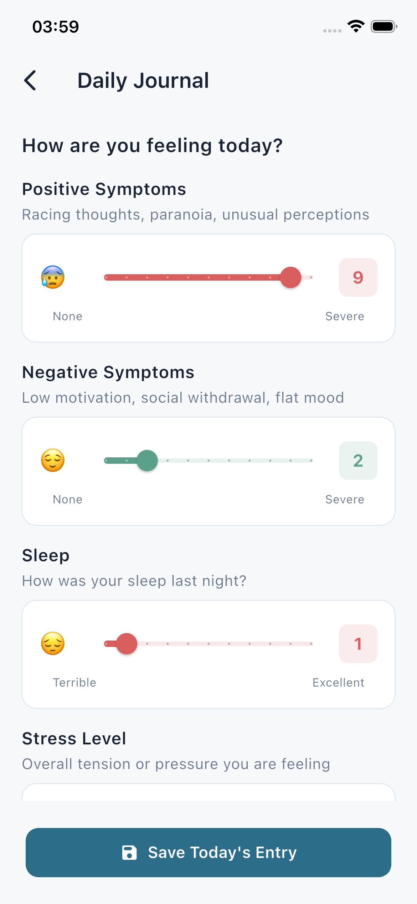
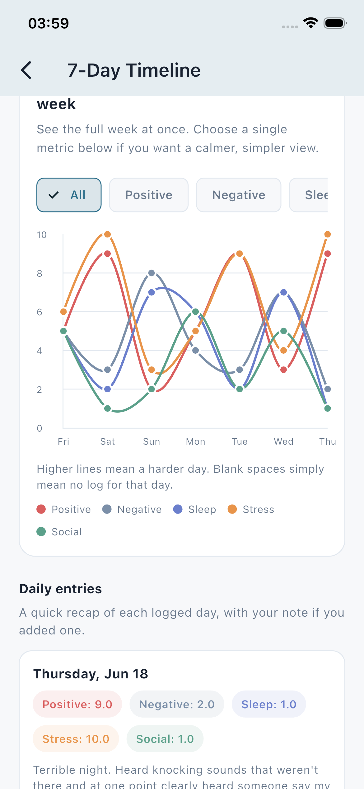
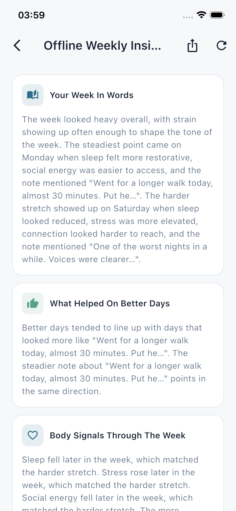
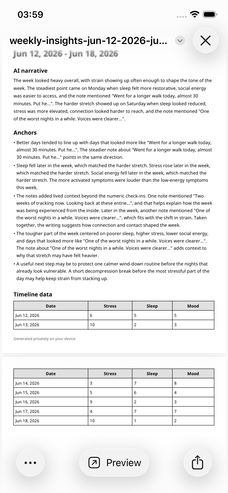

# AI Weekly Mental Health Insights Generator

A Flutter app for private mental health journaling, 7-day symptom tracking, offline weekly insight summaries, and PDF sharing.

---

## Features

| Screen | Description |
|--------|-------------|
| **Daily Journal** | Log daily mood and mental health signals such as racing thoughts, suspicion, sleep hours, stress, motivation, and social withdrawal with a low-friction journaling flow. |
| **7-Day Timeline** | Review the last seven days in a clear `fl_chart` trend view to spot changes, patterns, and early shifts over time. |
| **Weekly Insights** | Generate a calm weekly reflection from recent journal data using local AI with Flutter Gemma and the Qwen3 0.6B model, so analysis stays private on-device and remains available offline after setup. |
| **Share As PDF** | Export the generated weekly insight summary as a PDF for personal records or optional sharing with a clinician, caregiver, or support network. |

---

## Screenshots

### Home



### Daily Journal



### 7-Day Timeline



### Weekly Insights



### PDF Preview



---

## Architecture

```
lib/
├── core/
│   ├── di/          # GetIt dependency injection
│   ├── error/       # Failure classes
│   ├── router/      # go_router configuration
│   ├── theme/       # AppTheme (Material 3, calm clinical palette)
│   └── utils/       # AppConstants
└── features/
    ├── journal/
    │   ├── data/
    │   │   ├── datasources/  # Hive local data source
    │   │   ├── models/       # JournalEntryModel (Hive adapter)
    │   │   └── repositories/ # JournalRepositoryImpl
    │   ├── domain/
    │   │   ├── entities/     # JournalEntry
    │   │   ├── repositories/ # Abstract JournalRepository
    │   │   └── usecases/     # SaveJournalEntry, GetWeeklyEntries
    │   └── presentation/
    │       ├── bloc/         # JournalBloc / Event / State
    │       └── pages/        # JournalPage, TimelinePage
    └── insights/
        ├── data/
        │   ├── datasources/  # On-device insight generation and model setup
        │   ├── models/       # WeeklyInsightsModel + prompt builder
        │   ├── repositories/ # InsightsRepositoryImpl
        │   └── services/     # PDF export and local model install helpers
        ├── domain/
        │   ├── entities/     # WeeklyInsights
        │   ├── repositories/ # Abstract InsightsRepository
        │   └── usecases/     # GenerateWeeklyInsights
        └── presentation/
            ├── bloc/         # InsightsBloc / Event / State
            ├── pages/        # InsightsPage
            └── widgets/      # Offline model install gate and insight views
```

**State management:** BLoC (`flutter_bloc`)  
**Navigation:** `go_router`  
**Local storage:** Hive  
**Charts:** `fl_chart`  
**Local AI:** `flutter_gemma` with an on-device Qwen3 0.6B LiteRT model  
**Export:** `pdf` + `printing`

---

## Getting Started

### 1 — Clone & install dependencies

```bash
flutter pub get
```

### 2 — Install the on-device model

The weekly insights flow uses Flutter Gemma with a local Qwen3 0.6B model.
On first launch, the app prompts the user to install the model on-device.
This download is roughly 498 MB and is required once per device before offline insights can run.

Why local AI:

- Better privacy: journal content stays on the device during analysis.
- Offline capability: weekly summaries continue to work without an internet connection after model setup.
- Lower operational risk: no external AI key management or cloud inference dependency.

### 3 — Regenerate Hive adapters (if you change the model)

```bash
flutter pub run build_runner build --delete-conflicting-outputs
```

### 4 — Run

```bash
flutter run
```

---

## Running Tests

```bash
flutter test
```

---

## Privacy And Offline Design

- Weekly insights are designed to run locally on the device using Flutter Gemma.
- The bundled inference flow uses the Qwen3 0.6B model file configured in the app.
- Journal analysis can remain available without a network connection after the model is installed.
- PDF export makes it easier to preserve or share summaries without exposing raw journal data to a cloud AI service.

---

## Future Improvements

- Add richer PDF customization, including branded report layouts, trend charts, and optional masking of sensitive sections.
- Support multiple local models or model quality tiers so users can choose between smaller, faster, or more capable offline inference.
- Expand insight quality with more structured prompts, confidence framing, and safer wording around early-warning signals.
- Add explicit clinician-sharing workflows such as consent screens, export history, and secure handoff options.
- Introduce reminders, streaks, and adherence-focused journaling nudges that stay respectful and low pressure.
- Improve accessibility with larger-type previews, voice input for journaling, and better chart narration for screen readers.
- Add deeper tests around offline model installation, insight generation states, and PDF export behavior.
